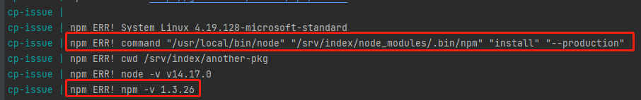

# cp-issue
To show the issue of child process module,about [this issue](https://github.com/nodejs/help/issues/3417#issuecomment-947394802)

## Usage
### require
1. [docker](https://docs.docker.com/get-docker/) > 20
1. [docker-compose](https://docs.docker.com/compose/install/) > 1.29
### run
1. build and run the container
> docker-compose up -d

1. show the log
> docker-compose logs -f

And you can see the result like below picture

But I did use the `14.17` version docker image about node, and the npm version is `6.14.13`.Just because I installed `1.3.26` npm in the `./package.json`, and when I remove or update the npm package from `./package.json`, everything will be okay.
